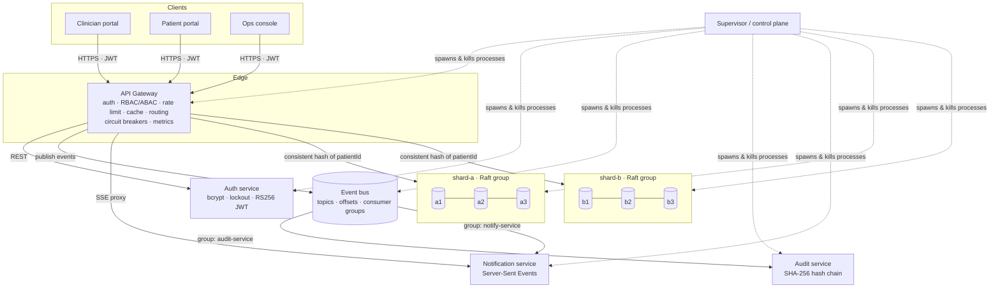
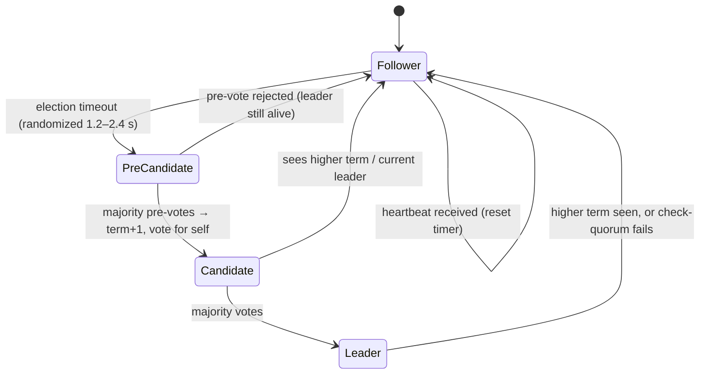
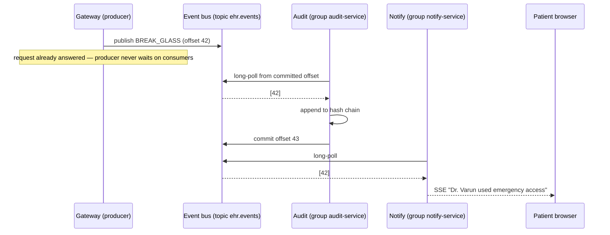

# Architecture — MediChain Distributed EHR

## 1. System overview

Every box is a **separate OS process** (11 in total) talking HTTP. There is no shared memory: killing any process is a real crash.

## 2. Data placement: sharding + replication

* **Sharding (horizontal partitioning):** a patient id is hashed onto a ring of 2 × 150 virtual nodes ([consistent-hash.js](../src/common/consistent-hash.js)).
  All keys of one patient (`patient:<id>`, `records:<id>`, `consent:<id>`) land on the same shard. This co-location means every request for one patient touches exactly one Raft group.
* **Why consistent hashing:** adding a 3rd shard moves ≈ 1/3 of patients. With `hash mod N` it would move ≈ 2/3 (≈ 80 % going 4 → 5, as measured in test TC-HASH-10).
* **Replication:** each shard is a 3-replica Raft group. It tolerates **1 failure** per shard (a majority of 2/3 is required).

## 3. Raft consensus ([raft-node.js](../src/raft/raft-node.js))

| Mechanism | Purpose |
| --- | --- |
| Randomized election timeouts | avoid split votes |
| Election restriction (§5.4.1) | only a candidate with an up-to-date log can win, so no committed entry is ever lost |
| **PreVote** (thesis §9.6) | a node coming back from a partition cannot force a needless election (TC-RAFT-05) |
| Log matching + fast backtracking | followers repair divergent logs; the leader skips back a whole term at a time |
| Commit only current-term entries (§5.4.2) + no-op on election | prevents the "Figure 8" anomaly |
| Write-ahead log, fsync-before-reply | term/vote/log survive crashes; torn final writes are discarded (TC-WAL-02) |
| **Check-quorum** | an isolated leader steps down instead of serving stale data |
| **Lease reads** | strong reads are served by a leader only while a majority acknowledged it recently → linearizable |
| Client request dedup (`requestId`) | retried writes after a failover are applied exactly once |

**Write path:**
1. Gateway → leader `/kv/command`.
2. The leader appends to its WAL and sends AppendEntries to the followers.
3. Once a majority has stored the entry, the leader advances `commitIndex`.
4. Every replica applies the entry to its state machine **deterministically**: timestamps are stamped once by the leader and never read from the local clock.

## 4. Consistency model

| Operation | Consistency | Served by |
| --- | --- | --- |
| Read a patient record / consents | **Linearizable** (lease read) or cached | shard leader, or gateway cache |
| Patient directory (names, demographics) | **Eventual** (may lag ≤ 1 heartbeat) | any follower — read replicas offload the leader |
| Consent part of the directory | Linearizable | leader (it drives access decisions) |
| All writes | Linearizable | leader + majority |

**CAP trade-off:** each shard is **CP**. Without a majority it refuses writes (HTTP 503, TC-CHAOS-03) instead of diverging.
The *system* stays partially available: if one shard is entirely down, the other keeps serving and the directory returns partial results with a `degraded` flag (TC-CHAOS-02).

## 5. Fault-tolerance mechanisms at the gateway ([shard-client.js](../src/gateway/shard-client.js))

* **Leader tracking & redirects:** a follower answers `421 NOT_LEADER` with a leader hint, and the client follows it immediately.
* **Failover with retry:** on a network error or 503 the client retries other replicas with **exponential backoff + full jitter** until a deadline (8 s). In practice the client sees a slower request (≈ one election timeout), **not an error**. Measured: 0 client errors in the chaos and load tests.
* **Circuit breaker per replica:** after 2 consecutive failures a dead replica is skipped instantly for 2.5 s, then probed with a single trial call (HALF_OPEN).
* **Heartbeat failure detector:** the cluster monitor polls every replica once a second and publishes `NODE_DOWN / NODE_UP / LEADER_ELECTED`.
* **Producer outbox:** audit events are buffered in memory if the event bus is down and flushed with backoff. The clinical request never fails because auditing is temporarily unavailable (TC-BUS-08).

## 6. Asynchronous communication ([event-bus.js](../src/eventbus/event-bus.js))

* Each consumer **group** keeps its own offset, so every group sees every message (fan-out).
* Offsets are committed **after** processing, giving at-least-once delivery. Consumers are idempotent (the audit service de-duplicates by event id, TC-AUDIT-02).

## 7. Security architecture

| Layer | Control | Test evidence |
| --- | --- | --- |
| Authentication | bcrypt hashes, lockout after 5 failures, identical errors for unknown user / bad password | TC-AUTH-02, 03 |
| Tokens | RS256 JWT. Only auth holds the private key; every service verifies locally. `alg:none` / HS256 forgeries rejected | TC-AUTH-07, TC-API-02 |
| Authorization | RBAC (role) + ABAC (consent, ownership, expiry, emergency) in one pure function, every decision audited | 28-row decision table, TC-RBAC |
| Least privilege | admins operate the platform but **cannot read clinical data** | DT-03, TC-API-12 |
| Emergency access | break-glass needs a ≥10-char reason, lasts 30 min, alerts the patient in real time | TC-API-15, E2E-06 |
| Encryption at rest | AES-256-GCM per field (phone, ABHA id, note text) **before** replication, so storage nodes only see ciphertext | TC-API-21, E2E-12 |
| Integrity | SHA-256 hash-chained audit ledger detects edits, deletions and re-ordering | TC-CHAIN-03..05, E2E-11 |
| Zero trust | internal endpoints require a service token even on the private network | TC-SEC-08 |
| Abuse | token-bucket rate limits per user and per IP (login), 200 kB body limit | TC-SEC-04, 06, 07 |
| Browser | CSP `script-src 'self'`, `X-Frame-Options: DENY`, nosniff; all output escaped | TC-SEC-01, E2E-08 |

## 8. Performance techniques

* **Cache-aside** at the gateway (LRU, 30 s TTL, prefix invalidation on every write). The UI shows HIT/MISS per request.
* **Parallel scatter-gather** for cross-shard queries.
* **Read replicas** for eventually-consistent reads.
* **Batching** of AppendEntries (up to 64 entries per RPC) and immediate re-replication when a follower lags.
* **Async processing:** auditing and notifications are off the request path.
* Measured numbers: [reports/load-test.md](../reports/load-test.md) (generated by `npm run test:load`).

## 9. Observability

* `GET /metrics`: Prometheus text format (request counters by route/status, latency histograms, cache hit ratio, events published).
* `X-Request-Id`: correlation id propagated gateway → shard → event → audit entry (distributed tracing).
* Ops Console: live topology, per-replica term/commit index/log length, breaker states, consumer-group lag, live event stream.

## 10. Known limitations / future work

* No log compaction or snapshots, so the WAL grows unbounded (Raft §7). This is fine for demo volumes.
* Static membership (no joint consensus for adding replicas at runtime).
* Single gateway instance. Multiple gateways would need cache invalidation over pub/sub.
* TLS terminates in front of the gateway in production (NGINX / cloud load balancer). Local development runs over HTTP.
* MFA (TOTP) and an OIDC identity provider (Keycloak) are natural next steps.
* Future-work items from the slides: blockchain-anchored audit, anomaly detection on access patterns, FHIR/ABDM interoperability.
